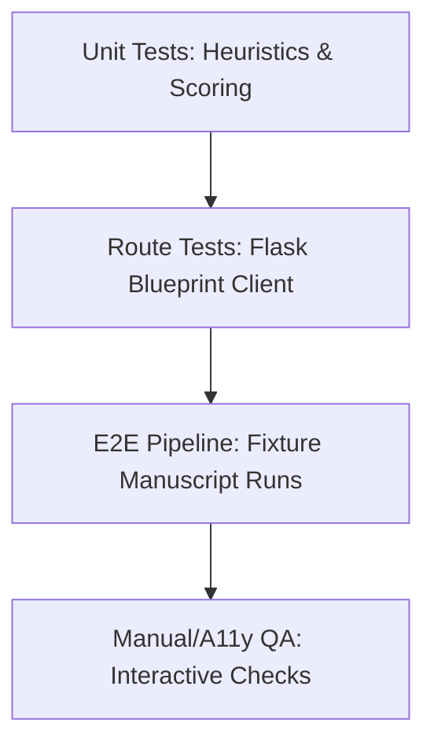

# Swarmbook Studio 360-Degree Testing Plan

This document outlines the comprehensive test strategy, coverage matrix, and quality gates for the Swarmbook Studio manuscript stress-testing engine and frontend dashboard views.

---

## 1. Test Architecture & Scope

Swarmbook is validated across four testing layers to guarantee local privacy compliance, workstation stability, and WCAG accessibility standards:



### A. Backend Unit Testing (`backend/tests/`)
- **Focus**: Algorithmic correctness of scoring functions, character mapping, nonfiction claim extraction, local configuration loaders, cache storage keys, and YAML fallback parsers.
- **Tools**: Python `unittest` standard library runner.

### B. Blueprint Route Integration Testing (`backend/app/api/`)
- **Focus**: Serialization formats, status code propagation, error codes, and dynamic health socket checks.
- **Execution**: Flask test-client blueprint mock configurations.

### C. E2E pipeline Integration Testing (`backend/tests/test_book_sim_e2e.py`)
- **Focus**: Bounded execution of local profiles: `Basics -> Upload -> Evidence Packs -> Persona Generation -> Platform Reactions -> Scoring -> JSON/Markdown Export`.
- **Execution**: Small fiction/non-fiction sample text files.

### D. Manual QA & Accessibility Validation
- **Focus**: Responsive stacking, keyboard navigation (Space/Enter), focus ring states, and WCAG AA contrast ratio compliance.

---

## 2. Automated Test Matrix & Edge Cases

| Scenario / Category | Automated Test Case | Expected Result / Assertion |
|---|---|---|
| **Input Limits** | Ingest empty text / upload invalid format | Raises `ValueError` or API returns `400 Bad Request` with `invalid_input` details. |
| **Oversized Manuscript** | Upload paste exceeding 500,000 chars | surfeaces `file_too_large` error details warning. |
| **Privacy Guardrail** | Call cloud providers in `local_only` mode | Raises `PrivacyViolationError` at provider method level and blueprint-level request filter. |
| **Config Loader Fallbacks**| Load configs without `PyYAML` library | Fallback custom parser reads files successfully, matching YAML parsed dictionaries. |
| **Scoring Consistency** | Replay scoring engine on identical seed | Returns identical predicted star bands, DNF lists, and priority points. |
| **Persona Interrogation** | Query persona with missing stored reactions | Graceful fallback responder responds using standard template rationale. |
| **Diagnostics Sockets** | Ollama / Neo4j services offline | Sockets check fails gracefully, returning `503 Service Unavailable` status and troubleshooting logs instead of crashing. |
| **Comparison UUIDs** | Compare invalid project ids or empty items | API endpoint returns `404 Not Found` or empty checklist scorecard with warning. |

---

## 3. Manual UI Accessibility & Responsive QA Checklist

### A. Focus State Indicators
- Target focus ring is high-contrast orange (`outline: 2px solid #FF4500; outline-offset: 2px`).
- Assert focus outline appears on all:
  - Form text areas and text inputs.
  - Setup sliders and dropdown selects.
  - Step links, project options, and action buttons.

### B. Keyboard Accessibility (Space/Enter Triggers)
- Custom select wrappers (`role="radio"`, `role="button"`) must listen to both Enter and Space keypress events.
- Elements checked:
  - Drag-and-drop file upload zone.
  - Stepper navigation progress items.
  - Cohort selection pill-buttons.
  - Profile selection cards.
  - Editorial maps tab select buttons.

### C. Text Contrast (WCAG 2.2 AA)
- Normal text (under 18pt) must maintain a minimum contrast ratio of **4.5:1** against the background.
- Backgrounds are primarily `#FFFFFF` and `#F8FAFC`.
- All captions, instructions, and microcopies are styled using `--sb-text-muted` (`#64748b` - **4.76:1** contrast) to ensure text legibility. Inactive stepper text color must not drop below `#64748b`.

### D. Screen Width Responsiveness (Desktop, Tablet, Mobile)
- Grids must stack into a single-column layout using media queries for widths $\le$ 950px.
- Check view behaviors:
  - **Desktop ($\ge$ 1024px)**: Grid lists, side-by-side timelines, and settings consoles.
  - **Tablet (768px to 1023px)**: Single column workflow panel, stacked settings widgets.
  - **Mobile ($\le$ 600px)**: Compact sidebar hidden behind navbar menu toggle, inputs stack vertically, data tables scroll horizontally.

### E. Motion Reduction Support
- Check animation behaviors when system/browser settings prefer reduced motion:
  - Card hover scale transitions must be disabled.
  - Fade animations for success messages must be instant.
  - Simulation running loading spinners must stop spinning.

---

## 4. Execution & Validation Protocols

### Running Automated Test Runner
From the root workspace folder, run the unittest discover command:
```powershell
python -m unittest discover -s backend/tests -p "test_book_sim_*.py"
```

### Validating Frontend Production Build
From the `frontend/` subdirectory, execute:
```powershell
node .\node_modules\vite\bin\vite.js build
```
Ensure build compiles with **zero compile warnings** and outputs minified CSS/JS bundle files.
