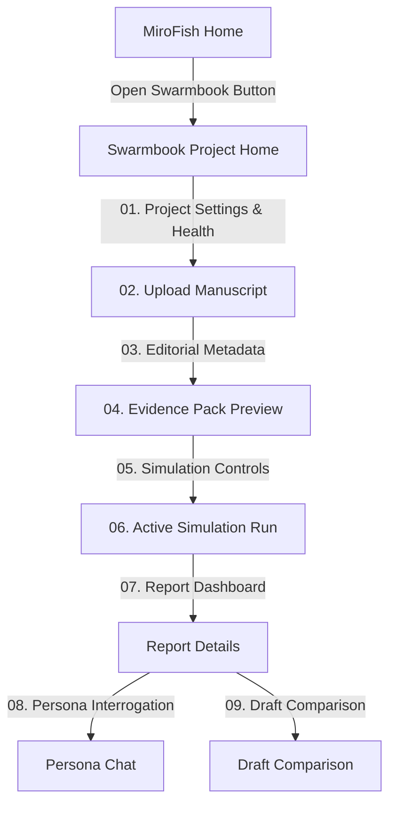

# Swarmbook UI Redesign Plan

## 1. Information Architecture
The new Swarmbook interface maintains a distinct local-first manuscript stress-testing path separate from the main MiroFish unstructured document prediction views. Swarmbook uses a multi-step wizard structure mapped directly to Vue routing, with a shared navigation layout to maintain session context.

## 2. Target Screens
To deliver a SaaS-grade UX rather than a developer demo, the following core screens compose the redesigned flow:

1. **Swarmbook Project Home (`SwarmbookHomeView.vue`)**: Setup project name, title, author, select local resource profile (`local_tiny`, `hybrid_safe_default`, `cloud_quality`), privacy mode, and display runtime health checks (Router, Neo4j, Ollama status).
2. **Manuscript Input (`SwarmbookUploadView.vue`)**: Plain text load, PDF/Markdown drag-and-drop ingestion zone, with length/character warnings for heavy documents.
3. **Metadata Form (`SwarmbookMetadataView.vue`)**: Collect editorial metadata including category/genre, target reader, blurb, comp titles, and cover brief to seed the model routes.
4. **Evidence Pack Preview (`SwarmbookEvidenceView.vue`)**: Comprehensive read-only tabbed dashboards visualizing generated Book DNA, Market Surface, Chapter Map, Character Map, Claim Map, Risk Map, and Style Map.
5. **Simulation Controls (`SwarmbookSimulationView.vue`)**: Run configurations (resource profiles, persona count, simulation seed, execution modes, platform toggles) with hardware load warnings.
6. **Report Dashboard (`SwarmbookReportView.vue`)**: Star rating distributions, DNF risks, Controversy index, Viral potential per platform, representative posts, and prioritized revision checklist.
7. **Persona Interrogation (`SwarmbookPersonasView.vue`)**: Interactive direct chat with individual generated personas to test audience response.
8. **Draft Comparison (`SwarmbookCompareView.vue`)**: Side-by-side scorecard comparison showing rating/DNF delta and Markdown exports.

## 3. Design Principles
- **Local First, Privacy Explicit**: Keep privacy levels (`local_only`, `hybrid_safe`, `cloud_quality`) and model provider status (Ollama, Neo4j, Gemini, NVIDIA) clearly visible in all views.
- **Explainable Metrics**: Show confidence bands, rating distributions, and evidence references. No raw numbers without context.
- **SaaS-Grade Visuals**: Dark-accents, monospaced tech elements (`JetBrains Mono`), and high-contrast, structured tabular panels replacing plain card lists.
- **Additive Isolation**: Completely separate `/swarmbook/*` UI from MiroFish, avoiding breaks in MiroFish's graph or simulation routes.

## 4. Component Map

| Component Category | Component Name | Responsibility | Status |
|---|---|---|---|
| Layout | `SwarmbookLayout.vue` | Header, Wizard Navigation steps, Global Errors, Health Indicator | **Reusable (Needs Aesthetic Polish)** |
| Ingest | `UploadZone` | Handles drag-and-drop, file type validation, and loading indicators | **Inline (Move to reusable component)** |
| Data Display | `MetricCard` | High-contrast premium stat boxes showing delta values & trends | **New** |
| Interactive | `PersonaSelector` | Profile cards showing user name, archetype, platform, and quick actions | **New** |
| Visualizations | `ScoreDistributionChart` | D3-based bar or violin plot showing the synthetic star ratings | **New** |

## 5. Accessibility Requirements (WCAG 2.2 AA)
- **Contrast**: Text and interactive elements must maintain a minimum contrast ratio of 4.5:1 against the background (using defined theme variables).
- **Visible Labels**: Form inputs must have descriptive, permanently visible labels rather than relying solely on placeholders.
- **Focus States**: Interactive buttons, input fields, and options must feature high-visibility outlines (`outline: 2px solid #FF4500`) when focused via keyboard navigation.
- **Screen Reader Support**: Use semantic tags (`<header>`, `<nav>`, `<main>`, `<article>`, `<section>`) and appropriate ARIA attributes where state shifts dynamically (e.g. `aria-busy="true"` on loading actions).

## 7. Implementation Phases
1. **Phase 1: Design Tokens & Layout Hardening**: Define variables, polish `SwarmbookLayout`, implement focus styling.
2. **Phase 2: Ingest & Metadata Redesign**: Refactor file upload zone and metadata inputs to include inline validation and character counters.
3. **Phase 3: Evidence Pack Tabs & Reusable Visual Cards**: Group extraction maps into tabbed segments to reduce vertical scrolling.
4. **Phase 4: Dashboard & Charts Integration**: Add premium metrics visualizations (synthetic star ratings, viral spreads) using lightweight D3 or custom SVG charts.
5. **Phase 5: Interrogation & Comparison Refinement**: Create bubble-chat layout for persona queries and split-screen columns for draft comparison.
